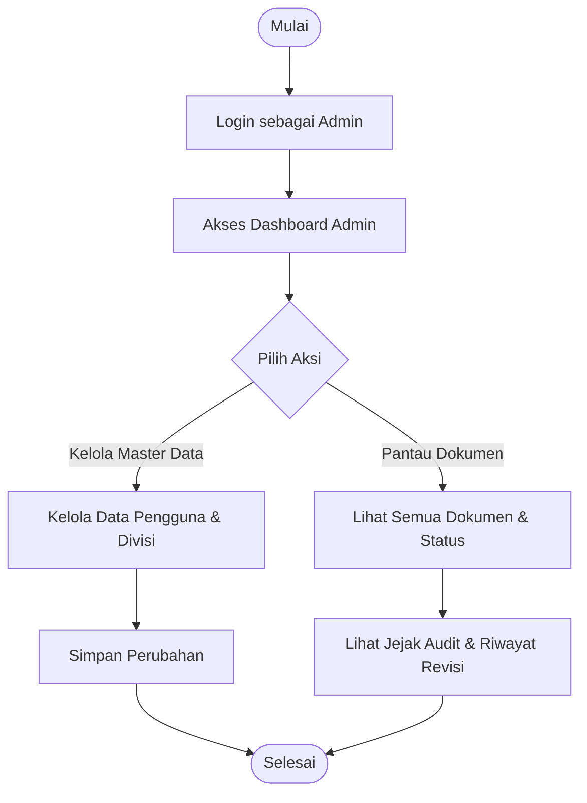
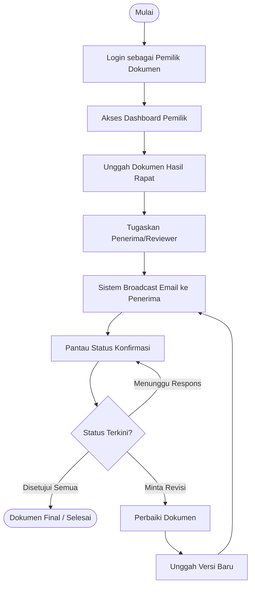
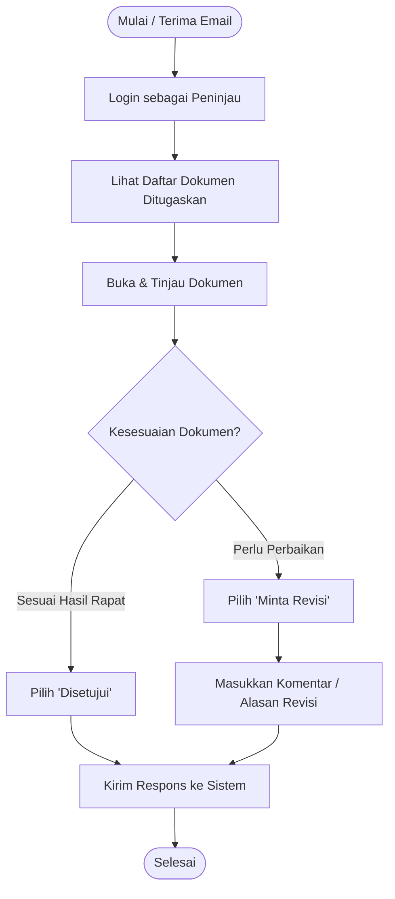

# Dokumen Kebutuhan Bisnis (Business Requirements Document - BRD)
## Proyek: Docucast (Sistem Sosialisasi Dokumen)

### 1. Ringkasan Eksekutif
Docucast adalah sistem publikasi (broadcast) dan sosialisasi dokumen yang dirancang khusus untuk memfasilitasi proses finalisasi dokumen pasca-rapat atau diskusi. Sistem ini memastikan bahwa draf dokumen hasil diskusi dipublikasikan kepada pihak-pihak terkait (penerima) untuk mendapatkan persetujuan akhir (sign-off) atau mengumpulkan usulan revisi jika dokumen belum sesuai dengan hasil diskusi sebelumnya. Sistem ini bertujuan menggantikan proses konfirmasi manual dengan alur kerja digital yang otomatis, transparan, dan memiliki jejak audit yang jelas.

### 2. Tujuan Proyek / Tujuan Bisnis
- **Pemusatan Publikasi Dokumen:** Memigrasikan 100% proses sirkulasi dan publikasi dokumen pasca-rapat ke dalam sistem Docucast dalam 3 bulan pertama setelah peluncuran, membangun satu sumber kebenaran (single source of truth) untuk proses finalisasi.
- **Otomatisasi Konfirmasi & Sign-off:** Mengotomatiskan proses pengumpulan respons (terima/revisi) dari penerima untuk mengurangi beban administratif manual setidaknya sebesar 30% dalam waktu 6 bulan.
- **Memastikan Akuntabilitas:** Mencapai kepatuhan 100% dalam kemampuan pelacakan dokumen dengan mengimplementasikan jejak audit yang tidak dapat diubah, yang mencatat semua respons penerima mulai dari hari pertama penerapan.
- **Mempercepat Finalisasi:** Mengintegrasikan notifikasi waktu nyata (real-time) melalui Email untuk mempercepat proses persetujuan akhir dokumen yang telah didiskusikan, dengan target 80% dokumen difinalisasi dalam waktu 48 jam setelah di-broadcast.

### 3. Ruang Lingkup Proyek
**Dalam Lingkup (In-Scope):**
- Unggah dokumen terpusat dan pembuatan versi otomatis.
- Pembuatan kode dokumen yang unik.
- Kontrol Akses Berbasis Peran (RBAC) untuk Admin, Pengunggah (Uploader), dan Peninjau (Reviewer).
- Penugasan penerima untuk peninjauan dokumen.
- Fungsionalitas pengiriman ulasan (Setujui / Minta Revisi) dengan komentar dan lampiran.
- Perhitungan status dokumen secara otomatis (Tertunda, Dalam Peninjauan, Membutuhkan Revisi, Disetujui).
- Notifikasi waktu nyata melalui Email.
- Manajemen pengguna dan divisi.
- Pencatatan jejak audit dan riwayat revisi yang tidak dapat diubah.

**Di Luar Lingkup (Out-of-Scope):**
- Integrasi dengan sistem ERP perusahaan eksternal (kecuali ditentukan secara spesifik di kemudian hari).
- Pengeditan konten dokumen tingkat lanjut di dalam aplikasi (misalnya, pengeditan teks kolaboratif seperti Google Docs).

### 4. Kebutuhan Bisnis
- **BR-01 (Kontrol Dokumen):** Sistem harus memungkinkan pengguna untuk mengunggah berkas dan melacak versinya secara otomatis, mengarsipkan versi lama dengan aman saat ada pembaruan.
- **BR-02 (Identifikasi Unik):** Sistem harus menetapkan pengidentifikasi unik pada setiap dokumen saat dibuat (misalnya, `#UploaderID-Tanggal-DocID`).
- **BR-03 (Alur Kerja Peninjauan):** Sistem harus memungkinkan pemilik dokumen untuk menugaskan pengguna tertentu sebagai penerima/peninjau wajib.
- **BR-04 (Keputusan Peninjauan):** Sistem harus memungkinkan penerima untuk mengirimkan keputusan peninjauan mereka (`Disetujui` atau `Revisi`) beserta berkas dan komentar opsional.
- **BR-05 (Otomatisasi Status):** Sistem harus menghitung status dokumen secara otomatis berdasarkan agregat hasil peninjauan.
- **BR-06 (Sistem Notifikasi):** Sistem harus mendukung notifikasi melalui Email yang dipicu oleh peristiwa tertentu (penugasan, pengiriman, pengingat).
- **BR-07 (Jejak Audit):** Sistem harus memelihara riwayat yang tidak dapat diubah atas semua tindakan yang terkait dengan versi dokumen tertentu.

### 5. Daftar Pemangku Kepentingan (Stakeholders)
| Peran Pemangku Kepentingan | Deskripsi |
|----------------------------|-------------|
| **Admin** | Mengelola konfigurasi sistem, Pengguna, Divisi, Dokumen, dan mengawasi seluruh alur kerja. |
| **Pengunggah / Pemilik Dokumen** | Mengunggah dan mempublikasikan (broadcast) dokumen hasil diskusi, mengatur penanda setuju otomatis (auto-approve), menugaskan penerima, dan melacak status konfirmasi akhir. |
| **Peninjau / Penerima** | Menerima publikasi dokumen, meninjau kesesuaian konten dengan hasil diskusi, dan mengirimkan konfirmasi penerimaan atau usulan revisi. |

### 6. Kendala Proyek (Project Constraints)
- **Tumpukan Teknologi (Technology Stack):** Aplikasi harus dibangun menggunakan Laravel 12 (PHP 8.4), Livewire 4, Filament v5, dan Tailwind CSS v4.
- **Keamanan:** Harus menggunakan hashing kata sandi, Spatie Permissions untuk RBAC, dan penyimpanan berkas yang aman melalui disk Laravel Storage.
- **Infrastruktur:** Notifikasi bergantung pada ketersediaan layanan SMTP Email.

---

## Spesifikasi Sistem Tambahan

### A. Peran & Izin Pengguna
Sistem menggunakan kontrol akses berbasis peran (RBAC) yang didukung oleh Filament Shield. Peran yang diantisipasi meliputi:
- **Admin**: Akses penuh ke sistem. Dapat mengelola Pengguna, Divisi, Dokumen, dan mengawasi seluruh alur kerja.
- **Pengunggah / Pemilik Dokumen**: Dapat mengunggah dokumen baru, menugaskan peninjau, dan melacak status dokumen mereka.
- **Peninjau / Penerima**: Dapat melihat dokumen yang ditugaskan dan mengirimkan ulasan mereka (Setujui atau Minta Revisi).

### B. Diagram Sistem

#### B.1. Flowchart Sistem (Berdasarkan Peran)

**1. Flowchart Admin**

**2. Flowchart Pengunggah / Pemilik Dokumen**

**3. Flowchart Peninjau / Penerima**

### C. Kebutuhan Fungsional Secara Detail
#### C.1. Manajemen Dokumen
- **Unggah & Pembuatan Versi**: Pengguna dapat mengunggah berkas. Sistem secara otomatis melacak versi dokumen. Ketika berkas baru diunggah ke dokumen yang ada, versi baru akan dibuat dan versi lama diarsipkan dengan aman.
- **Bendera Persetujuan Otomatis (Auto-Approve)**: Dokumen dapat secara opsional ditandai untuk disetujui secara otomatis.

#### C.2. Alur Kerja Konfirmasi & Persetujuan
- **Perhitungan Status**: Sistem secara otomatis menghitung status dokumen berdasarkan respons agregat penerima:
  - *Tertunda (Pending)*: Belum ada respons atau penerima yang ditugaskan.
  - *Dalam Peninjauan (In Review)*: Proses konfirmasi sedang berlangsung, tetapi belum semua penerima menyetujui kesesuaian dokumen, atau ada usulan revisi.
  - *Membutuhkan Revisi (Requires Revision)*: Dokumen ditolak dan memerlukan penyesuaian berdasarkan usulan revisi penerima.
  - *Disetujui (Approved)*: Semua penerima yang ditugaskan telah menerima dan menyetujui kesesuaian dokumen hasil diskusi.

#### C.3. Notifikasi
- **Saluran (Channels)**: Email.
- **Pemicu (Triggers)**:
  - *Dokumen Ditugaskan*: Memberi tahu penerima saat mereka ditugaskan untuk meninjau sebuah dokumen.
  - *Ulasan Dikirim*: Memberi tahu pemilik dokumen saat penerima mengirimkan ulasan.
  - *Pengingat*: Sistem mengirimkan pengingat untuk peninjauan yang tertunda.

#### C.4. Manajemen Divisi & Pengguna
- **Divisi**: Pengguna tergabung dalam unit organisasi tertentu (divisi).
- **Pengguna**: Profil pengguna yang diperluas menyimpan NIK (Nomor Induk Karyawan), Nomor Karyawan, Jabatan, dan Divisi.

### D. Kebutuhan Non-Fungsional Secara Detail
- **Auditabilitas**: Setiap tindakan peninjauan dan pembaruan dokumen dicatat dengan aman.

### E. Ringkasan Model Data
- **Pengguna (Users)**: Tabel pengguna inti dengan info karyawan.
- **Divisi (Divisions)**: Pemetaan unit organisasi.
- **Dokumen (Documents)**: Catatan inti dokumen (Judul, Deskripsi, Jalur berkas, Status).
- **Versi Dokumen (DocumentVersions)**: Cuplikan historis dari berkas dokumen.
- **Penerima Dokumen (DocumentRecipients)**: Tabel pivot yang memetakan Dokumen kepada Peninjau yang diwajibkan.
- **Ulasan Dokumen (DocumentReviews)**: Keputusan ulasan individu (Status, Komentar, Lampiran).
- **Riwayat Revisi (RevisionHistories)**: Log tindakan alur kerja untuk jejak audit.
