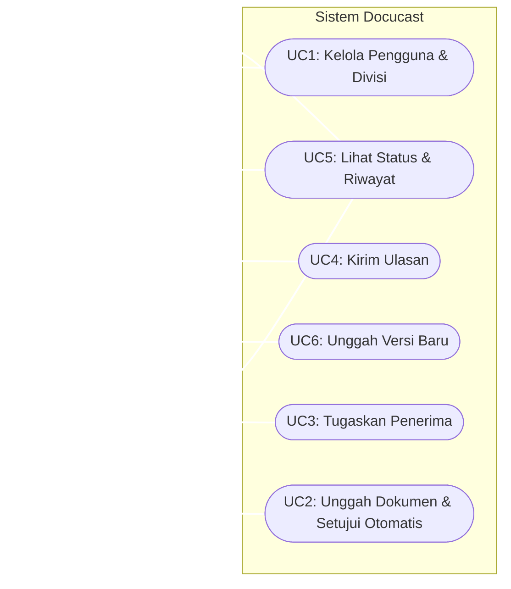
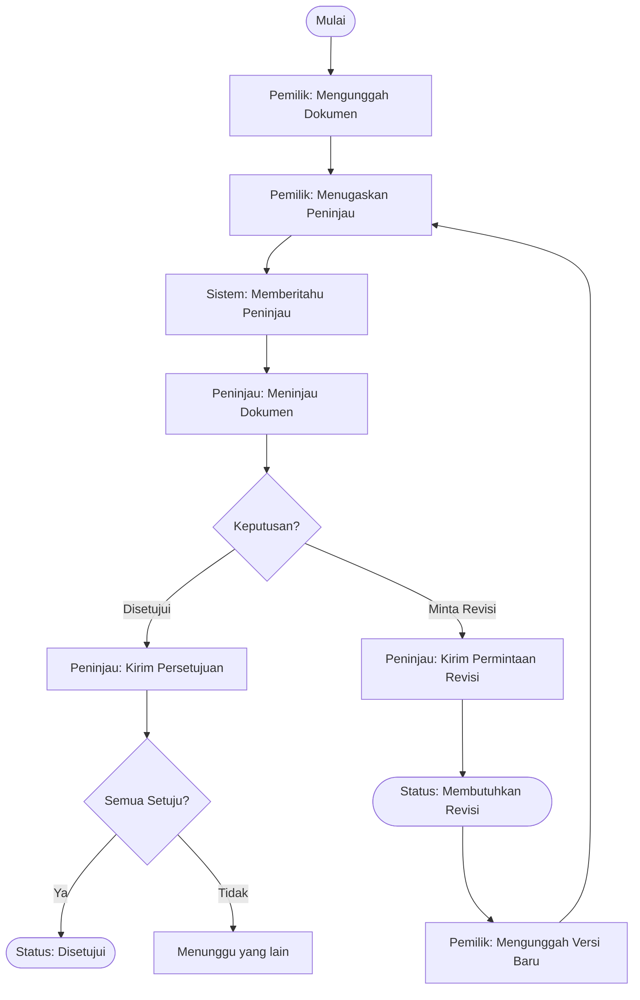
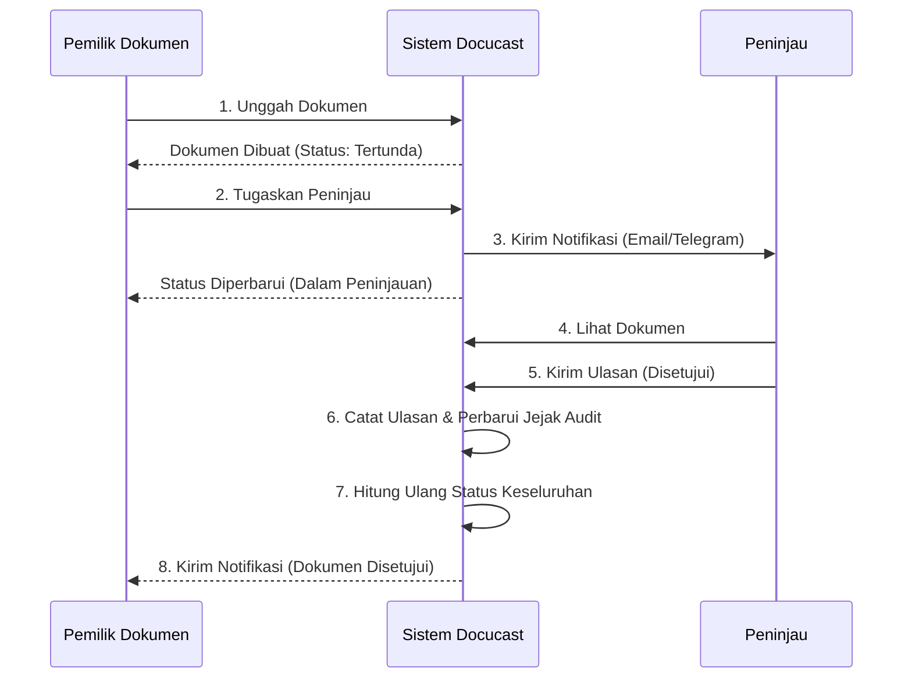

# Product Requirements Document (PRD)
## Produk: Docucast (Sistem Sosialisasi Dokumen)

### 1. Ringkasan & Tujuan (Overview & Objectives)
**Ringkasan:**
Docucast adalah sistem publikasi dan sosialisasi dokumen terpusat yang dirancang untuk memfasilitasi proses finalisasi dokumen pasca-rapat. Sistem ini bertindak sebagai sumber kebenaran tunggal (single source of truth), mengotomatiskan proses distribusi, peninjauan, dan persetujuan (sign-off) untuk menggantikan pelacakan manual dan utas email yang tidak teratur.

**Tujuan:**
- **Pemusatan Publikasi Dokumen:** Memigrasikan 100% sirkulasi dokumen pasca-rapat ke Docucast dalam 3 bulan pertama setelah peluncuran.
- **Otomatisasi Konfirmasi:** Mengurangi beban kerja administratif manual setidaknya 30% dalam waktu 6 bulan melalui pengumpulan ulasan secara otomatis.
- **Memastikan Akuntabilitas:** Mencapai 100% kepatuhan dengan jejak audit yang tidak dapat diubah (immutable audit trail) dari semua respons peninjau sejak hari pertama.
- **Mempercepat Finalisasi:** Memastikan 80% dokumen difinalisasi dalam waktu 48 jam setelah didistribusikan melalui notifikasi waktu nyata (real-time) via Email/Telegram.

### 2. Pernyataan Masalah (Problem Statement)
Saat ini, organisasi bergantung pada proses manual, komunikasi ad-hoc (seperti aplikasi obrolan), dan utas email yang terpisah-pisah untuk mengedarkan dan memfinalisasi dokumen penting pasca-rapat. Hal ini menyebabkan:
- Tidak adanya sumber kebenaran tunggal untuk versi dokumen final.
- Kesulitan dalam melacak siapa saja yang telah meninjau atau menyetujui dokumen.
- Siklus umpan balik yang tidak efisien yang menyebabkan penundaan dalam finalisasi dokumen.
- Jejak audit yang hilang atau tersebar sehingga gagal memenuhi persyaratan kepatuhan yang ketat.

### 3. Ruang Lingkup Teknis (Technical Scope)
**Dalam Lingkup (In-Scope):**
- Unggah dokumen terpusat dan kontrol versi otomatis.
- Pembuatan kode pelacakan unik (`#UploaderID-Tanggal-DocID`).
- Kontrol Akses Berbasis Peran (RBAC) menggunakan Filament Shield (Admin, Pemilik Dokumen, Peninjau).
- Penugasan peninjau wajib dan alur kerja persetujuan (Setujui / Minta Revisi).
- Perhitungan status dokumen secara otomatis (Tertunda, Dalam Peninjauan, Membutuhkan Revisi, Disetujui).
- Notifikasi waktu nyata melalui Email dan Telegram.
- Jejak audit dan riwayat revisi yang tidak dapat diubah.
- Antarmuka responsif berbasis web dengan penampil PDF terintegrasi.

**Di Luar Lingkup (Out-of-Scope):**
- Integrasi dengan sistem ERP perusahaan eksternal.
- Pengeditan dokumen rich-text kolaboratif (seperti gaya Google Docs).

**Kendala (Constraints):**
- Harus dibangun dengan Laravel 12 (PHP 8.4), Livewire 4, Filament v5, dan Tailwind CSS v4.
- Harus menggunakan penyimpanan file lokal/cloud yang aman (Laravel Storage) dan hashing kata sandi.

### 4. Desain Sistem (System Design)

#### 4.1 Diagram Use Case

#### 4.2 Deskripsi Use Case
- **UC1: Kelola Pengguna & Divisi:** Admin dapat membuat, memperbarui, menghapus, dan melihat pengguna (termasuk NPK, No. Karyawan, Jabatan, Chat ID) dan divisi.
- **UC2: Unggah Dokumen & Setujui Otomatis:** Pemilik Dokumen mengunggah file baru, menghasilkan kode unik dan membuat Versi 1. Dapat ditandai sebagai "Setujui Otomatis" (Auto-Approve).
- **UC3: Tugaskan Penerima:** Pemilik Dokumen memilih pengguna tertentu sebagai peninjau wajib. Status dokumen berubah menjadi *Dalam Peninjauan* dan notifikasi dikirimkan.
- **UC4: Kirim Ulasan:** Peninjau mengevaluasi dokumen dan mengirimkan status *Disetujui* atau *Minta Revisi*, dengan opsi tambahan komentar/lampiran. Sistem menghitung ulang status keseluruhan.
- **UC5: Lihat Status & Riwayat:** Semua aktor dapat melihat metadata dokumen, status agregat, dan jejak audit yang tidak dapat diubah (Riwayat Revisi) berdasarkan tingkat akses mereka.
- **UC6: Unggah Versi Baru:** Ketika dokumen *Membutuhkan Revisi*, Pemilik mengunggah file baru. Sistem mengarsipkan versi lama, menaikkan nomor versi, dan mengatur ulang ulasan.

#### 4.3 Diagram Aktivitas (Activity Diagram)
**Alur Kerja Peninjauan Dokumen**

#### 4.4 Diagram Urutan (Sequence Diagram)
**Alur Persetujuan Utama**

### 5. Kriteria Keberhasilan (Success Criteria)
- **Adopsi:** 100% divisi target secara aktif menggunakan sistem untuk dokumen pasca-rapat dalam waktu 3 bulan.
- **Efisiensi:** Rata-rata waktu finalisasi dokumen berkurang menjadi di bawah 48 jam untuk 80% dokumen.
- **Kepatuhan:** Tidak ada log audit yang hilang (nol kehilangan); 100% tindakan peninjauan dapat dilacak secara terverifikasi di dalam sistem.
- **Keandalan:** Tingkat keberhasilan pengiriman notifikasi (Email/Telegram) > 99%.
